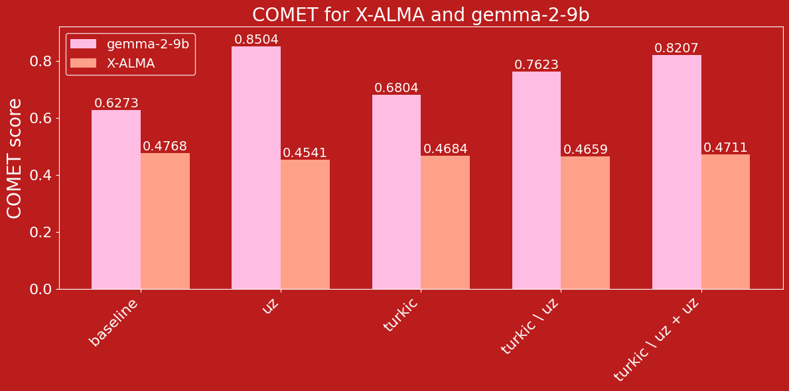
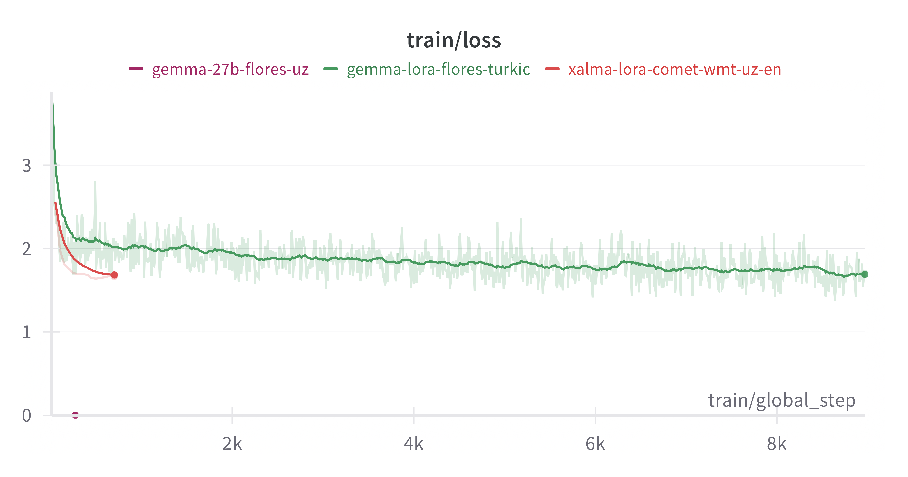
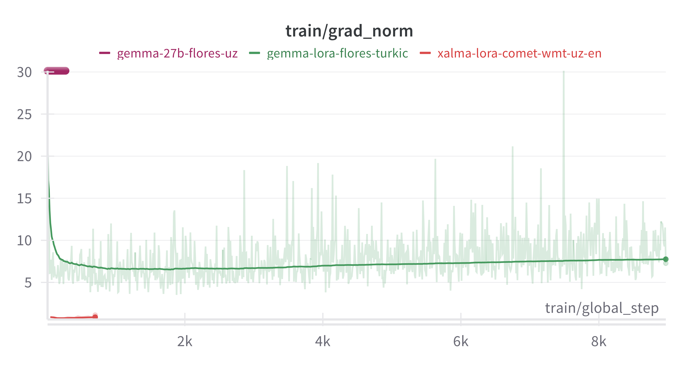
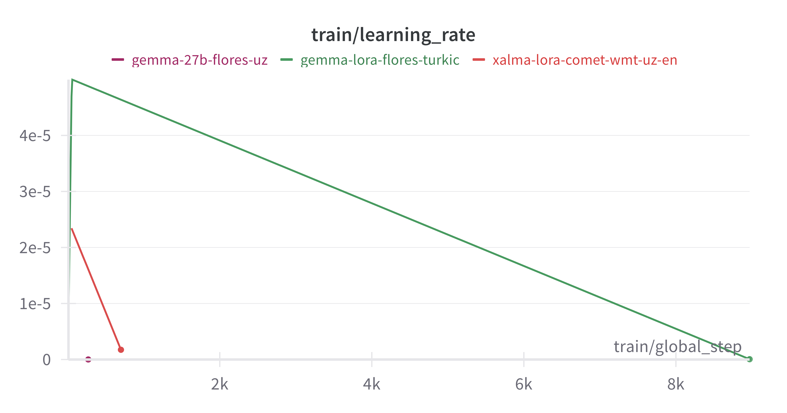

# Научно-практический интенсив по воспроизведению SotA научных результатов, Яндекс х Сириус
# Исследование Мультиязычных LLM для задачи Машинного Перевода

## Тема исследования:
Проект исследует, как большие языковые модели (LLM) приобретают способность выполнять машинный перевод для малоресурсных языков, на примере перевода **с узбекского языка (uz) на английский (en)**.

## Статьи
- [X-ALMA](https://arxiv.org/pdf/2410.03115)
- [LoRA: LOW-RANK ADAPTATION OF LARGE LAN-
GUAGE MODELS](https://arxiv.org/pdf/2106.09685)
- [Multilingual Machine Translation with Large Language Models](https://arxiv.org/pdf/2304.04675)

## Основные цели:
Мы проверили, как на качество UZ-EN перевода влияет обучение (SFT) предобученной модели по следующим стратегиям:
1. **SFT только на узбекском языке**
2. **SFT на тюркской группе языков**
3. **SFT на тюркской группе языков без узбекского**
4. **SFT на тюркской группе языков без узбекского + SFT на узбекском языке**


## Модель
В качестве модели использовалась **[X-ALMA-13B](https://github.com/fe1ixxu/ALMA/tree/7e0dae8a1f40179326c60b1ce7d23f54d938457f)**, [hugging-face X-ALMA](https://huggingface.co/haoranxu/X-ALMA-13B-Pretrain/tree/main) — SotA для 50 языков.


Для сравнения обучалась модель **[google/gemma-2-9b](https://ai.google.dev/gemma/docs), [hugging-face модели](https://huggingface.co/google/gemma-2-9b)**, выделяющаяся среди остальных мультиязычностью (100+ мультиязычных данных)

## Метрики
Для оценки качества UZ-EN перевода использовалась метрика [**COMET-22**](https://github.com/Unbabel/COMET)

## Данные

Для обучения модели использовался датасет [**FLORES-200**](https://github.com/facebookresearch/flores/blob/main/flores200/README.md). Обучение проводилось на [dev](data/flores200_dev) сплите, а валидация выполнялась на [devtest](data/flores200_devtest) сплите.
В обучающей выборке порядке 1000 параллельных данных для каждого языка. Валирдация проводилась на 100 рандомно выбранных примерах

## Результаты


## Структура репозитория
```bash
├── data/                   # Данные для экспериментов
├── data_processing/        # Скрипты для подготовки датасетов
├── scripts/                # Скрипты для обучения моделей
├── requirements.txt        # Зависимости проекта
├── README.md               # Описание проекта (данный файл)
```

## Графики
Ошибка на трейне


Норма градиента


Learning rate 

